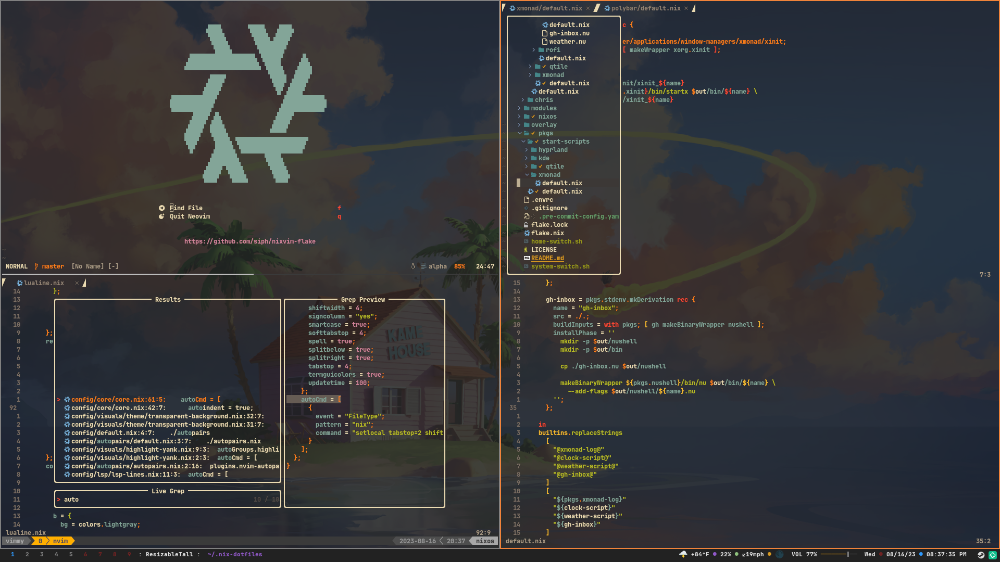

Neovim configuration build using
[nixvim](https://github.com/nix-community/nixvim) complete with lsp,
treesitter, and more.

## Screenshot


## How to Run

You can run this directly from the command line with:
```shell
# Full featured version
nix run github:sudosu4pp/nixvim-flake

# Lighter version without lsp.
nix run github:sudosu4pp/nixvim-flake#lite
```

